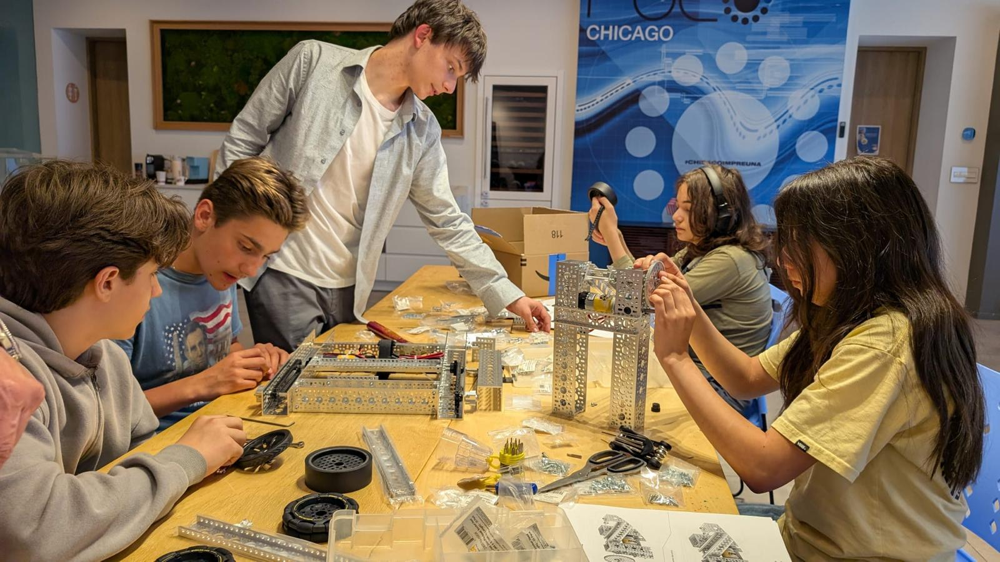
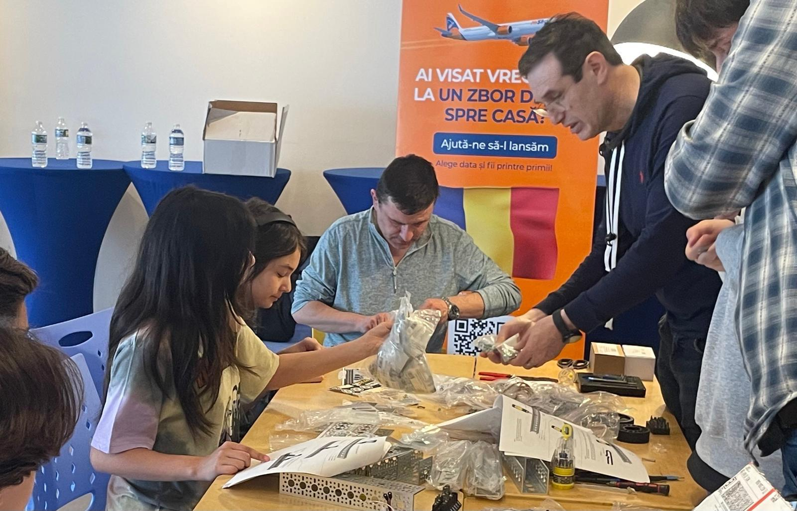

# ROCO Robotics @ Romanian Community Center

*After‑school build club for curious makers, ages 12–16*

---

## Build Robots. Hack Pumpkins. Dream of Mars.

Hands‑on engineering with **goBILDA**, **Arduino + LEDs**, computer vision **AI**, and a mini **Mars‑Rover** challenge.

**[Register now →](#registration)**
Fall session starts **October 2025** (limited seats).

---

## What this is

ROCO Robotics is a volunteer‑led makers program in Chicago where kids learn by **building real hardware**, writing **real code**, and **working as a team**. We combine the proven goBILDA FTC‑style platform with approachable electronics (Arduino) and beginner‑friendly AI vision to keep the learning curve exciting and achievable.

* **Who:** Kids ages **12–16** (no prior experience required)
* **Where:** Romanian Community Center, Chicago
* **When:** Weekly, **2 hour sessions** on Saturdays at 2PM
* **Mentors:** Experienced engineers and parent volunteers
* **Cost:** We aim to keep this **low‑cost** via donations and sponsors

---

## Summer 2025 Recap — goBILDA Build

This summer our crew designed and assembled a robust goBILDA robot:

* Frame, drivetrain, gear ratios, and wiring
* Basic tele‑op control
* First autonomous moves

We captured highlights (photos + short clips) showing teamwork, problem solving, and those first magical inches of robot motion.

---

## What’s Next — Fall 2025

We’re kicking off a new session with a seasonal maker mini‑arc, then we return to robots with fresh skills.

### 1) **Pumpkin Glow Lab** (Arduino + LEDs)

Create interactive Halloween pumpkins:

* Addressable LEDs (WS2812/“NeoPixel”) patterns
* Simple sensors (sound/IR button) for interactivity
* Basic Arduino code structure, variables, loops, and functions
* Safe tool use (hot glue, wire management)

**Showcase:** At ROCO, just before Halloween. Afterwards kids can take their projects to display at home and on their porch.

**Take‑home:** Kids keep their **Arduino UNO‑compatible** board and LED ring/strip to keep hacking at home.

### 2) **Back to Robots: goBILDA + AI Vision**

Build on our summer robot with smarter capabilities:

* Mechanisms: arms, intakes, mounts
* Controls: gamepad tuning, driver practice
* **AI camera**: beginner object detection, AI vision and text synthesis.
* Autonomy challenge: navigate a short course using vision

### 3) **Mini Mars Rover Challenge**

Put it all together in a playful mission scenario:

* Rough‑terrain drivetrain and suspension basics
* Sensor fusion for navigation (IMU + camera markers)
* “Sample collection” game: pick up and deliver foam cores
* Team demo day for family + friends

---

## Why it works

* **Project‑based:** Every session produces visible progress
* **Team roles:** Builder, coder, tester, documenter—everyone contributes
* **Real tools:** Kids use the same parts and software the pros use
* **Confidence first:** We scaffold early wins, then climb steadily

---

## Skills kids gain

* Mechanical design (chassis, gearing, fasteners)
* Electronics & wiring (power, polarity, safety)
* Programming fundamentals (Arduino C/C++, Python basics for vision)
* AI concepts (classification vs. detection, datasets, limits)
* Collaboration (stand‑ups, task boards, iterative improvements)

---

## Schedule (Draft)

> Final dates confirmed after registration closes.

* **Pumpkin Glow Lab:** 3–4 consecutive weeks in **October**
* **goBILDA + AI:** 6–8 weeks **Nov–Jan** (breaks for holidays)
* **Mini Mars Rover:** 4 sessions **Feb–Mar**, ending with **Demo Day**

**Session length:** 2 hours
**Time options:** Weeknight early evening on Thursdays **or** Saturday afternoon (majority rules which one)

---

## What to bring

* A curious mind and a willingness to try
* Personal laptop (Windows/Mac/Linux OK). We have shared machines too.

---

## Safety & Well‑being

We practice safe tool use, tidy wiring, and respectful teamwork. Parents/guardians sign a participation waiver; photo/video consent is optional and can be changed anytime.

---

## Parents, Volunteers, Sponsors

* **Volunteer:** Join us as a build coach or classroom helper—no robotics experience required. We’ll train you.
* **Sponsor a kit:** Help a student take home an Arduino/LED starter pack or fund shared goBILDA/AI parts.
* **In‑kind support:** We welcome gently used laptops, storage bins, and hand tools.

> *Add a sponsor strip here (logo row) and a donation button.*

---

## Registration

**Seats are limited.** We keep groups small to maximize hands‑on learning.
**[Pre‑register here](#)** to hold a spot; we’ll confirm your time slot and send the final calendar.

> *Insert registration link and form embed.*

---

## FAQ

**Is this for beginners?** Yes. We start simple and build up.
**Do kids need a laptop?** Recommended but not required; we have shared devices.
**What languages do you use?** JAVA for GoBilda, Arduino C/C++ and light Python for AI demos.
**Is this an FTC team?** We use FTC‑style hardware (goBILDA) and team habits; competition entry may be offered if enough interest.
**Make‑up sessions?** We’ll share build notes and code so kids can catch up.

---

## Contact

Questions? Want to help?
**Email:** [info@rocorobotics.org](mailto:info@rocorobotics.org)
**Location:** Romanian Community Center (Chicago)

---

## Media Gallery (placeholders)

> *Drop in a hero video (15–20s), plus a 3×3 grid of action photos. Add a short caption to each: what was learned or discovered.*

* [ ] Summer 2025 goBILDA build montage (short)
* [ ] Pumpkin Glow Lab teaser clips
* [ ] AI vision first‑try highlights
* [ ] Mini Mars Rover course map

---

### Credits

Program leads: Dorin Ilie Acu and Constantin Gavrilescu
Mentors: ROCO volunteers
Hardware: goBILDA, Arduino, Raspberry Pi / AI camera

---

